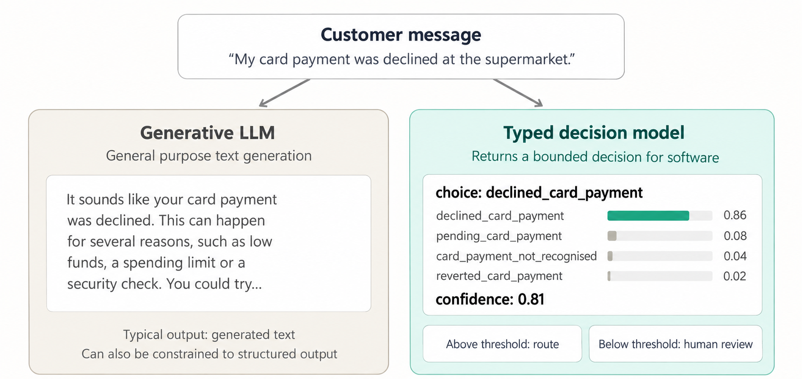
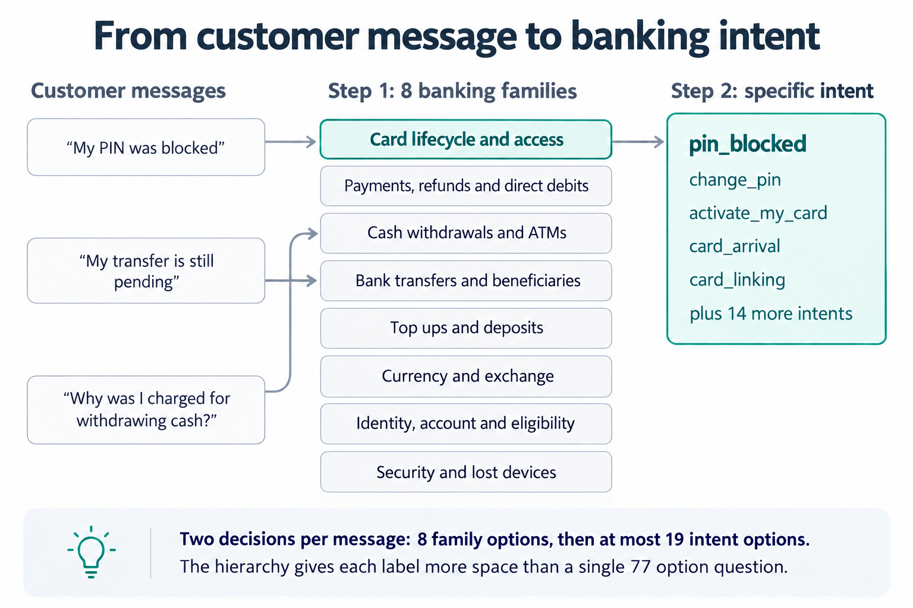
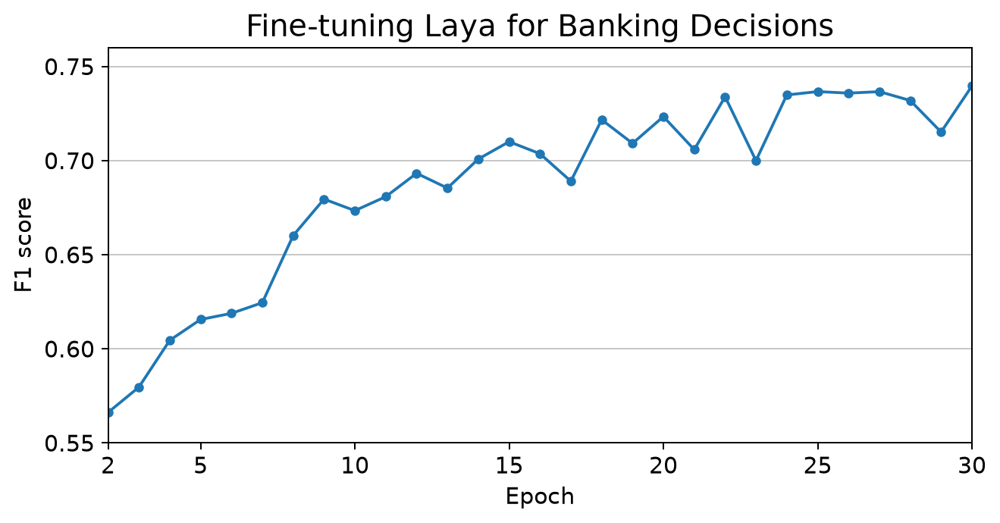
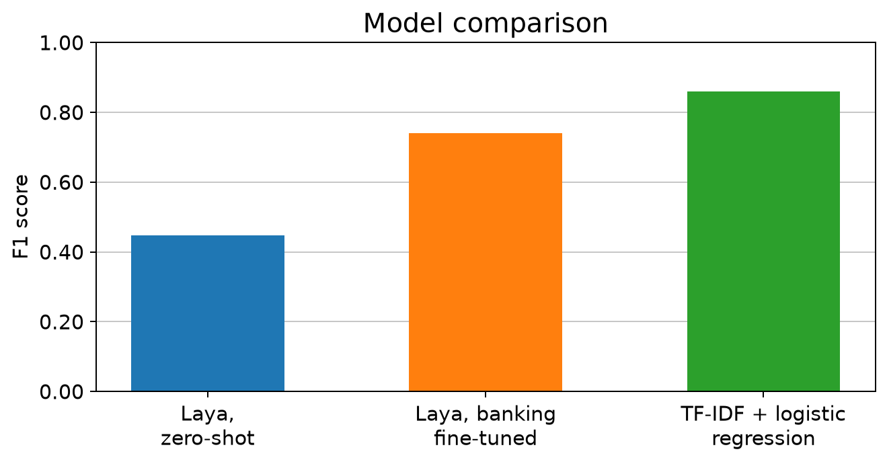

# Language aware decisions for banking

[](https://colab.research.google.com/github/dimitrisdais/language-aware-decisions-for-banking/blob/main/notebooks/01_fine_tune_and_compare.ipynb)
[](https://colab.research.google.com/github/dimitrisdais/language-aware-decisions-for-banking/blob/main/notebooks/02_inference_from_hugging_face.ipynb)
[](https://huggingface.co/dimitrisdais/laya-banking77-typed-decisions)

Jev made a simple idea interesting again: many software systems do not need an AI model to write a paragraph. They need it to return a constrained decision that another system can use.

Banks are not new to classifiers, scores, rules or calibrated probabilities. The interesting question is whether a language aware decision model can make those systems easier to specify, adapt and reuse while retaining outputs that software can consume directly.

This weekend experiment tests that question with an open model, a public banking dataset and one Colab GPU.



## The experiment

The project uses [Laya](https://github.com/NandhaKishorM/laya), an open source typed decision model inspired by the same System One direction as Jev, and adapts it to [BANKING77](https://huggingface.co/datasets/mteb/banking77).

Instead of asking one question with 77 options, the model makes two typed decisions:

1. Choose one of eight banking service families.
2. Choose the specific intent inside that family.

This hierarchy keeps each decision small and produces a normalized score for every one of the 77 intents.



The MTEB dataset snapshot used in the experiment contained 9,993 training queries. They were split into 7,994 fitting examples, 999 validation examples and 1,000 calibration examples. The official 3,080 example test split stayed outside model fitting and the reported comparison below.

## What was fine tuned

The Laya encoder was frozen. Only the typed decision heads were trained with supervised cross entropy, approximately 26.5 million trainable parameters. This is head only fine tuning, not LoRA and not Laya's upstream RLCD training recipe.

Each message supplied two targets: its broad banking family and its specific BANKING77 intent. Training ran for 30 epochs with checkpointing and validation after every epoch.



## Results

All results below report macro F1 on the validation split.

**Laya, zero-shot** scored **44.7%** macro F1. **Laya, banking fine-tuned** reached **74.0%**, an improvement of **29.3 percentage points**. **TF-IDF + logistic regression** scored **86.0%** and remained the strongest model on this fixed banking intent taxonomy.



The point is not that typed decision models replace classical machine learning. It is that an open, general language aware model could be adapted to a banking decision hierarchy over a weekend, while returning outputs designed for software rather than prose. A bank team could explore richer taxonomies, shared decision interfaces, multilingual data, policy context, selective automation and calibrated escalation.

## Repository guide

```text
.
├── notebooks/
│   ├── 01_fine_tune_and_compare.ipynb
│   └── 02_inference_from_hugging_face.ipynb
├── configs/
│   └── questions.json
├── src/
│   └── inference.py
└── artifacts/
    └── four article figures
```

### `01_fine_tune_and_compare.ipynb`

The full experiment: mount Drive, install dependencies, load and split BANKING77, define the decision hierarchy, train the classical baseline, evaluate unchanged Laya, fine tune the decision heads, select the best checkpoint and recreate the result plots.

The training loop is restart safe at epoch boundaries. Keep the same run name, rerun the notebook and it restores the model, optimizer and random state from Google Drive. A Colab GPU runtime is required.

### `02_inference_from_hugging_face.ipynb`

The shortest path to the result. It downloads the published checkpoint, loads the repository taxonomy and runs single message and batch predictions. No training is performed.

## Run the project

### Fast path: use the published model

Open the `02_inference_from_hugging_face.ipynb` notebook in Colab and run all cells.

### Reproduce the adaptation

1. Open the `01_fine_tune_and_compare.ipynb` notebook in a Colab GPU runtime.
2. Set `TARGET_TOTAL_EPOCHS` and `MAX_RUN_MINUTES` in the configuration cell.
3. Run all cells. Data, checkpoints and results are stored beneath `MyDrive/Banking AI Lab/language-aware-decisions-for-banking`.
4. If the runtime ends, reconnect and run all cells again with the same `RUN_NAME`.

Thirty epochs took several Colab sessions in the original experiment. A single training plus validation epoch took roughly nine minutes on the observed T4 runtime.

## Limitations

This is a demonstration, not a production banking control. BANKING77 contains customer service intents, not credit, fraud or regulatory decisions. The data is English only, the evaluation is in domain, the best epoch was selected on validation data and no production latency, fairness, robustness or governance claim is made.

The experiment also leaves the encoder frozen. Encoder fine tuning, adapters, LoRA, upstream RLCD training, multilingual data and better calibrated confidence are reasonable next experiments.

## Sources and licenses

* [Introducing System One Models and Jev](https://typesafe.ai/blog/introducing-system-one-models-and-jev)
* [Laya repository](https://github.com/NandhaKishorM/laya)
* [BANKING77 on Hugging Face](https://huggingface.co/datasets/mteb/banking77)
